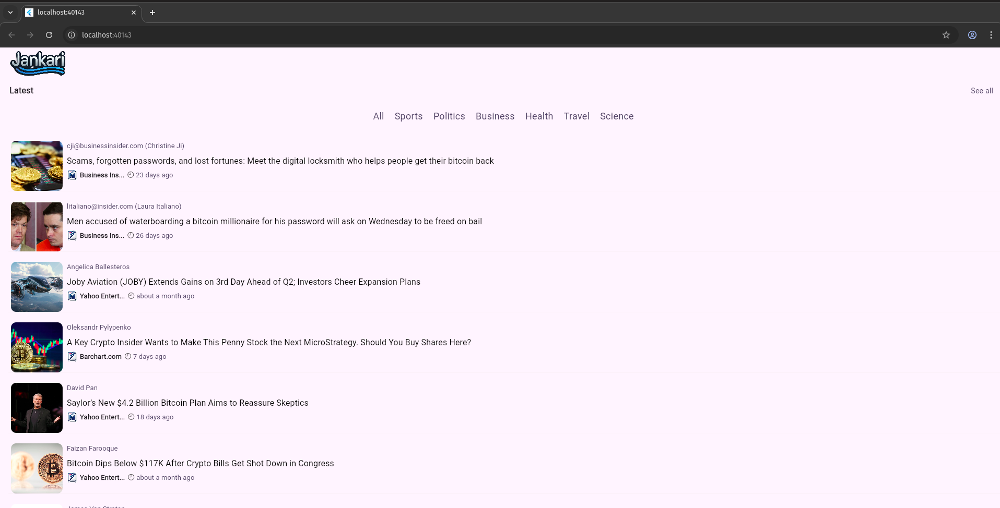
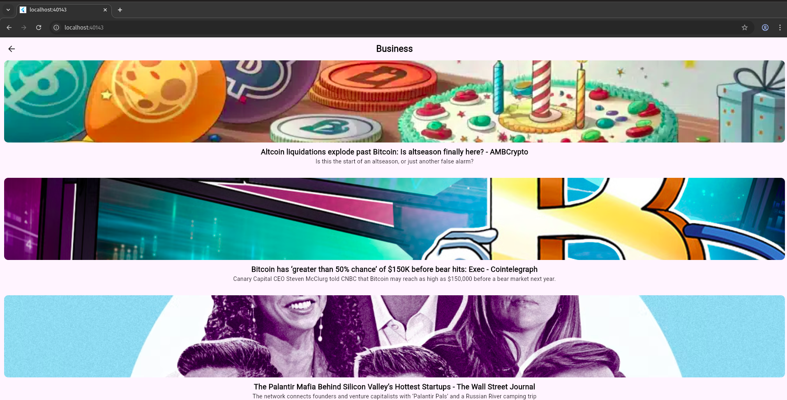
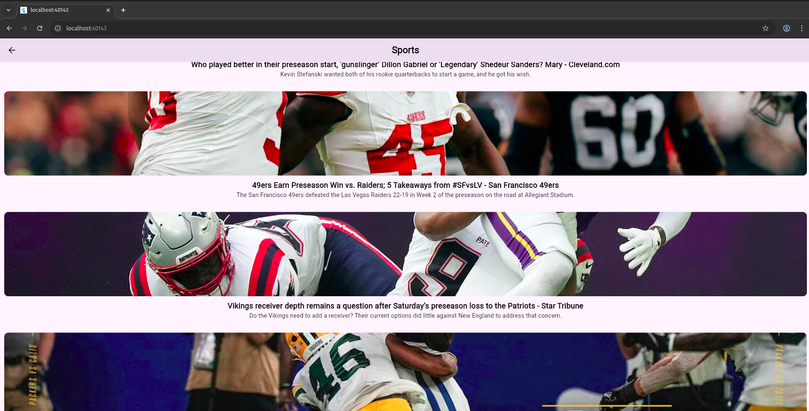
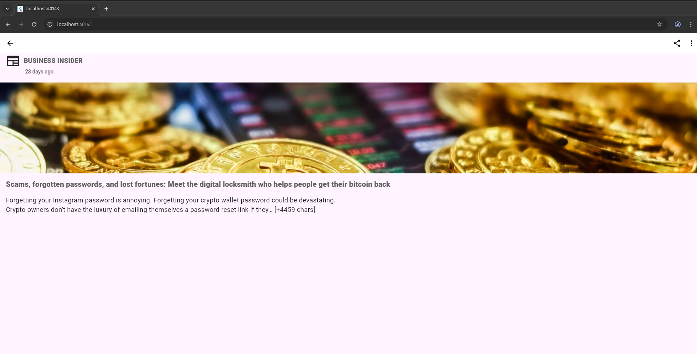
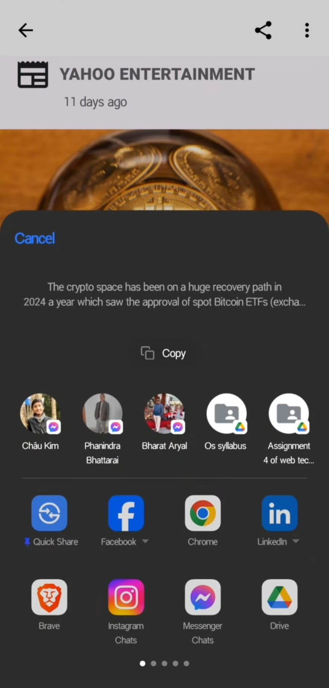

# 📰 News App

A dynamic Flutter news aggregator application that displays real-time updates from multiple sources using **REST APIs**.  
The app features categorized news, detailed article views, bookmarking, and sharing functionality.  

## 🚀 Features
- **Real-time News** fetched from REST APIs  
- **Category-based News** (Business, Sports, etc.)  
- **Detailed News Page** with full content  
- **Sharing Support** to quickly share articles  
- **Bookmarking** for offline reading  
- **Infinite Scroll** for seamless browsing  
- **Clean Architecture** with responsive UI  

## 📸 Screenshots (Mobile vs Web)

| Mobile View | Web View |
|-------------|----------|
|  |  |
|  |  |
|  |  |
|  |  |
|  |

## 📱 App Flow
1. **Home Screen** → View latest news headlines.  
2. **Categories** → Explore news by topic (Business, Sports, etc.).  
3. **Detail Page** → Read the full article with details.  
4. **Share** → Instantly share articles with others.  
5. **Bookmark (optional)** → Save articles for offline access.  

## 🛠️ Tech Stack
- **Framework**: Flutter (Dart)  
- **State Management**: Provider  
- **Networking**: REST APIs  
- **UI**: Material Design, Responsive Layout  

---

📌 This project demonstrates my ability to consume REST APIs, implement state management, and build a **real-world news application** with modern Flutter practices.
